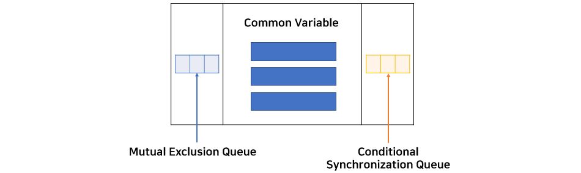

## 임계구역 문제

동기화의 대표적인 문제인 은행 잔고 문제를 살펴보자.

아래는 잔액을 추가할 때 사용되는 코드이다.

```
balance = balance + n
``` 

단순히 한 줄인것처럼 보이지만 **로우 레벨**로 바꿔보면 여러 줄로 실행된다.

메모리에서 balance를 조회하고, 거기에 n을 더하고, 그 값을 다시 balance에 할당한다. 이렇게 3줄에 걸쳐서 실행될 수 있다. 

그런데 도중에 스레드 스위칭이 일어나면? balance에 n을 더한 값을 다시 변수에 할당하지 않은 상태에서 스레드 스위칭이 일어나면 원하는 값이 출력되지 않을 수 있다.

이렇게 공유 자원의 접근 순서에 따라 실행 결과가 달라지는 프로그램의 한 영역을 critical section, 임계 구역이라고 한다. 임계 구역은 atomic(원자성) 해야 한다. 원자는 더 이상 쪼개지지 않는 가장 작은 단위이다. 해당 부분도 중간에 스위칭이 일어나지 않도록, 쪼개지지 않도록 원자처럼 단단해야 한다.

### 임계구역 문제 해결 조건

- 상호 배제(mutual exclusion)
    - 임계 구역에 오직 한 스레드만 진입할 수 있다.

- 한정 대기(bounded waiting)
    - 어느 스레드라도 유한 시간내에 들어갈 수 있다.

- 진행의 융통성(progress flexibility)
    - 진입 결정은 유한 시간내에 이루어진다.

## 세마포어(semaphore)

- 자바로 구현하면 다음과 같이 구현된다.(java.util.concurrent.Semaphore 에 구현되어 있음)
    ```
    class Semaphore {
        int value; //number of permit

        Semaphore(int value) {

        }

        void acquire() {
            value --;
            if (value <0) { //사용 가능한 자원이 없으면
                add this process/thread in list //list는 process/thread가 기다리고 있는 줄
                block
            }
        }

        void release() {
            value ++;
            if (value <=0) { //value가 0이거나 0보다 작다는 건 list에 누가 추가되어있다는 의미
                remove a process P from list;
                wakeup P; //list에서 해방시킨다.
            }
        }
    }
    ```

### 상호배제 도구로써의 세마포어

- 은행 잔고 코드에 세마포어를 추가해보자.
    ```
    sem.value = 1; //세마포어 허용가능 변수 1로 설정

    sem.acquire();
    balance = balance + n;
    sem.relesase();
    ```
    - 부모 프로세스가 먼저 acquire를 실행하면 value-- 되면서 value는 0이 되고 value <0 이 아니므로 부모 프로세스는 임계 구역에 들어간다.
    - 이때 컨텍스트 스위칭이 일어나 자식 프로세스가 acquire를 실행시키면 value 값이 -1이 되면서 list에 추가된다.
    - 부모 프로세스가 임계 구역에서 작업을 수행하고 sem.release()를 하면 value ++가 되면서 value는 0이 된다. 그리고 자식 프로세스를 wakeup시킨다.
    - list에서 기다리고 있던 자식 프로세스가 임계 구역에 진입한다.

### 진행순서를 제어하는 세마포어

- 무조건 P1 프로세스 -> P2 프로세스 순서로 실행시키고 싶다면?

- sem.value = 0으로 초기화한다.
    ```
    P1                          P2
                                sem.acquire(); //(3)
    S1  //(1)                   S2 //(4)
    sem.release(); //(2)              
    ```
    - P1이 먼저 실행된다면 S1작업을 하고 sem.release() 해서 value를 1로 만든다.
    - 다음으로 P2가 실행된다면 acquire을 통해 value--하고, value는 0이므로 S2 작업을 진행한다.
    - 반면, P2가 먼저 실행되었다면, acquire을 통해 value 값은 -1이된다. value <0 이므로 P2는 block된다.
    - 그리고 P1이 S1 작업을 하고 release() 작업을 통해 value++로 value를 0으로 만든다.(P1은 acquire 작업이 없음에 주의!) 그리고 P2를 wakeup한다.
    - P2가 보니, value==0이다. 따라서 S2작업을 수행한다.

## 모니터

### 세마포어의 문제점

세마포어는 P(), V() 연산 순서를 바꿔서 실행하거나, 둘 중 하나라도 생략하면 상호배제를 위반하는 상황이나 교착 상태가 발생하다는 문제점이 있다. 또한 P(), V()가 프로그램 전체에 구성되어 있으면 세마포어의 영향이 미치는 곳이 어딘지 파악하기 어렵기 때문에 세모파오를 사용하여 프로그램을 구현하기 어렵다.

모니터는 프로그래밍 언어 수준에서 제공된다. 대표적으로 Java에서 제공한다.

### 모니터 구조



모니터는 공유 자원(common variable==condition variable) + 공유 자원 접근함수로 이루어져 있고 2개의 큐를 가지고 있다.

- mutual exclusion queue(상호배타큐)
    - 공유 자원에 **하나의 프로세스**만 진입하도록 하는 큐 (모니터는 이진 세마포어임)
- conditional synchronization queue(조건동기큐)
    - 이미 공유자원을 사용하고 있는 프로세스가 wait()을 통해 조건동기 큐로 들어간다.

### 자바 모니터 예시

```java
class C {
  private int value, ...;     // 공유 변수
  synchronized void Foo() {   // 배타동기
    // ...
  }
  synchronized void Goo() {
    // ...
  }
  void H() {
    // ...
  }
}

```
자바의 synchronized 키워드는 스레드 동기화를 할 때 사용하는 대표적인 기법이다. 자바의 <모든 인스턴스는 Monitor를 가지고 있으며> Monitor를 통해 Thread 동기화를 수행한다.(?)

코드의 value를 common variable이라고 할 수 있고, synchronized 키워드는 배타동기를 수행하는 함수를 말한다. 즉, 해당 함수에는 단 하나의 쓰레드만 접근할 수 있다.

Foo() 함수와 Goo() 함수는 syncrhonized 키워드를 통해 상호 배타 함수로 선언하였는데, 이는 둘 다 "같은 임계구역을 갖는다"는 의미이다. Foo()에서 한 스레드가 작업중이라면 다른 스레드가 Foo()뿐만 아니라 Goo()에도 접근할 수 없다.

반면 H() 함수는 일반 함수인데, 여러 스레드가 접근가능하다.

조건 동기는 특정한 메서드 호출로 사용할 수 있다. 이는 condition variable 을 통해 구현되어 있다.

- wait(): 호출한 쓰레드를 조건동기 큐에 삽입한다.
- notify(): 조건동기 큐에 있는 하나의 쓰레드를 깨워준다.
- notifyAll(): 조건동기 큐에 있는 모든 쓰레드를 깨워준다.

- 참고
  - https://velog.io/@codemcd/%EC%9A%B4%EC%98%81%EC%B2%B4%EC%A0%9COS-11.-%EB%AA%A8%EB%8B%88%ED%84%B0  
  - https://tecoble.techcourse.co.kr/post/2021-10-23-java-synchronize/
